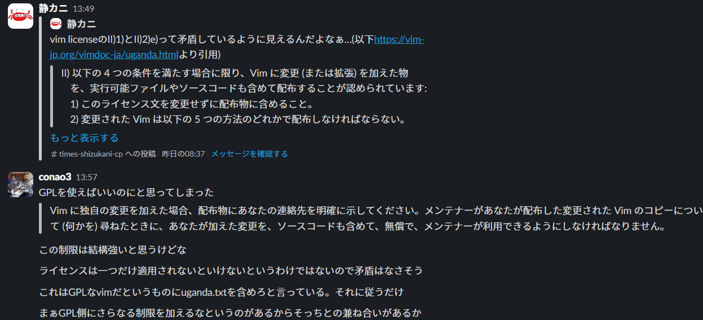

※この記事は[vim駅伝](https://vim-jp.org/ekiden/)の299本目の記事です。前回の記事は[@thinca](https://github.com/thinca)さんの[Meguro.vim #27 を開催しました](https://thinca.hatenablog.com/entry/2025/01/megurovim-27)です。次回でで300本!

この間なんとなく[vimのリポジトリ](https://github.com/vim/vim)を見ていてふとライセンスを見たら、「Vim License」と書いてありました。
そんなライセンスを知らなかったので、いろいろ見つつ解説していきます。

ちなみに、自分は大体のリポジトリはMITライセンスで公開しているのでそれと比較しながら解説しようと思います。
## MITライセンス
まずは、安心のMITライセンスです。原文は[こちら](https://opensource.org/license/MIT)、日本語訳は[こっち](https://licenses.opensource.jp/MIT/MIT.html)ですね。

MITライセンスは、何といってもその自由度が特徴です!

条文だけでも、ソフトウェアの複製を使用、複製、改変、結合、公開、頒布、再許諾、販売する権利、ソフトウェアを提供する人物に同様の行為をする権利が書いてあり、「これらに限られません」とまで書いてあります。

ただ、ソフトウェアを複製する場合は、著作権表示とかをしなきゃいけないようです。
ちなみに、作者は全く責任を負わないようです。私のようなMr.無責任にピッタリですね!(おい)
## vim license
次に、本題のvim licenseです。[ここ](https://vim-jp.org/vimdoc-ja/uganda.html)をスクロールすると、原文・日本語訳ともに見られるので、参考にしてください。というか、この記事では、この日本語版を読んで書いていたります。

これは、変更した場合と、変更していない場合とでちょっと義務が変わってくるので見ていきましょう。
### 変更した場合
まずは、ライセンス文を維持しなければいけないようです。…と思ったら「変更に GNU General Public License (GPL) が適用されている場合、GNU GPL バージョン 2、またはそれより新しいバージョンに基づいて、その変更された Vim を配布することができます。」って書いてある…
```
II) 以下の 4 つの条件を満たす場合に限り、Vim に変更 (または拡張) を加えた物を、実行可能ファイルやソースコードも含めて配布することが認められています:  
        1) このライセンス文を変更せずに配布物に含めること。
              ︙
        2) 変更された Vim は以下の 5 つの方法のどれかで配布しなければならない。
              ︙
          その変更に GNU General Public License (GPL) が適用されている場合、GNU GPL バージョン 2、またはそれより新しいバージョンに基づいて、その変更された Vim を配布することができます。」
```
…矛盾しないの？
というわけでvim-jpのslack(#tech-license)で聞いてみました。

で、次やらなきゃいけないのは、連絡先を明示することらしいです。たぶんGmailとかでもいいと思います。ここに電話番号とか書く人いなそうだし…。これには少なくとも3年、できる限り長く連絡がつくようにしないといけないようです。
その次!何やら元との差分を表示しなきゃ行けないようです。そして、その変更点を少なくとも3年間は保持しないといけないようです。その3年間の間は、メンテナーなりいろんな人が変更点を利用できるようにしないといけないようです。

さらに、「これ変更した後のやつだから」的なのが分かるように`:version`コマンドとか起動時のメッセージとかでわかるようにしなきゃ行けないらしいです。

あと、結構重要かもしれないのですが、本人が訂正しない限り連絡先は変更・削除できないっぽいです。まぁ、勝手に人の連絡先を変えるのは…ね。
### 変更しなかった場合
まず、「Vim のコピーを変更せずに配布することは、このライセンス文を含めなければならないこと以外に制限されません。」と条文にしっかり書いてあるので、結構自由ですね。
あと、一部分だけとか、自分が作ったものも同梱とかも、OKらしいです。
というか、変える・変えないどっちの場合にしてももライセンス変えるなってところでは[CC BY-SA](https://creativecommons.org/licenses/by-sa/4.0/deed.ja)とちょっと似てますね。
## まとめ
MITライセンス…とにかく自由!自由主義!(…なのか？自分はそういう認識)

vim license…変更しない限りはMITライセンスといい勝負。変更したらちょっと縛り。

## おまけ
MITライセンスをリポジトリに突っ込んでくれるPowerShell関数。profile.ps1に突っ込んどくと役に立つ。飽き性でリポジトリめっちゃ作る人限定だけど。
```profile.ps1
function Add-License {
  param (
    [string]$msg = "ライセンスを追加"
  )
  Write-Output(@"
MIT License

Copyright (c) {0} yourname

Permission is hereby granted, free of charge, to any person obtaining a copy
of this software and associated documentation files (the "Software"), to deal
in the Software without restriction, including without limitation the rights
to use, copy, modify, merge, publish, distribute, sublicense, and/or sell
copies of the Software, and to permit persons to whom the Software is
furnished to do so, subject to the following conditions:

The above copyright notice and this permission notice shall be included in all
copies or substantial portions of the Software.

THE SOFTWARE IS PROVIDED "AS IS", WITHOUT WARRANTY OF ANY KIND, EXPRESS OR
IMPLIED, INCLUDING BUT NOT LIMITED TO THE WARRANTIES OF MERCHANTABILITY,
FITNESS FOR A PARTICULAR PURPOSE AND NONINFRINGEMENT. IN NO EVENT SHALL THE
AUTHORS OR COPYRIGHT HOLDERS BE LIABLE FOR ANY CLAIM, DAMAGES OR OTHER
LIABILITY, WHETHER IN AN ACTION OF CONTRACT, TORT OR OTHERWISE, ARISING FROM,
OUT OF OR IN CONNECTION WITH THE SOFTWARE OR THE USE OR OTHER DEALINGS IN THE
SOFTWARE.
"@ -f (Get-Date).Year ) > LICENSE.txt
  git add LICENSE.txt
  git commit -m "${msg}"
}
```
※yournameはあなたのgithubのユーザー名とかをぶち込むところです。ちゃんと適宜調整してください。

次回はvim駅伝300本目!
