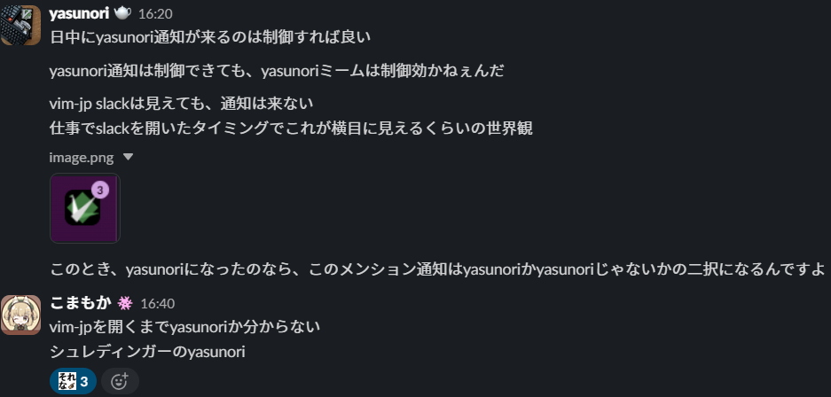

タイトルの意味はとりあえず下を見てもらえばわかると思います。

つまり、slackからの通知がvim-jpの通知であったとき、その通知はyasunoriかそうでないかになるという意味なのですが、
これはシュレディンガーの猫が元ネタっぽいので、それと比較してみます。(意味が分からない)
ここで遅れてしまいましたが、この記事は[vim駅伝](https://vim-jp.org/ekiden/)の第308回の記事です。
前回の記事は、[hokorobi](https://github.com/hokorobi)さんの[Windows で Vim を使った fuzzy find な定型文コピー]()です。
## シュレディンガーの猫
まず、シュレディンガーの猫というのは(私の認識では)、  
1. 原子が発射される  
2. 原子が観測装置の上の穴か下の穴を通る  
3. 通った穴によって、毒の瓶が倒れたり倒れなかったりする  
4. 毒の瓶と同じ空間にいる猫は毒で死んだり死んでなかったりする  
5. 猫が生きている確率は原子がどちらか片方を通っている確率と等しいが、その確率は半々の重ね合わせによって表現されている  
6. よって、猫は生きている状態と生きていない状態が半々重ね合わせられている  
というものです。もうちょっと続けると、  
7. 原子は観測するとどちらか一方の穴を通った場合に収束する  
8. 猫が生きているか死んでいるかも片方に収束する  
まであるかもしれません。  
もう少し信頼できた方がいい場合は、[Wikipedia](https://ja.wikipedia.org/wiki/%E3%82%B7%E3%83%A5%E3%83%AC%E3%83%BC%E3%83%87%E3%82%A3%E3%83%B3%E3%82%AC%E3%83%BC%E3%81%AE%E7%8C%AB)とかを参照してください。
## シュレディンガーのyasunori
さて、シュレディンガーの猫について書いたところで、本題のシュレディンガーのyasunoriと比較していきましょう。
イメージ的には、
1. デスクトップにslackからvim-jpに投稿があるとメッセージが来る  
2. vim-jpを見る(観測する)まで#times-yasunoriの投稿がどうかわからない  
という感じでしょうか。  
シュレディンガーの猫は、猫が生きている場合と死んでいる場合が半々で重ね合わせられていますから、それぞれの場合の確率が1/2の確率である必要があると考えられます。ですから、それを数えていきましょう。
まず、1/31の#times-yasunoriには約100の投稿がありました。  
そして…vim-jp全体は… **数えられません** でした。むずい。  
というわけで体感で行きます。私の場合、23個のチャンネルに参加しているのですが、一日で平均10件/チャンネルぐらいの感覚です。  
なので、一日230件ほど通知が来ることになります。そして、yasunoriは100件ほどですから、正確にとはいかなくとも、結構当てはまるのではないでしょうか。
## まとめ
シュレディンガーのyasunoriは割と当てはまる!だけど、当てはまらないときは全然当てはまらない(感覚)!vim駅伝の記事めっちゃ書いたぞ!ほかの記事見てね!  
ｺﾝｺﾝ「宣伝ぶち込むな」  
「ﾊｧｲ」
