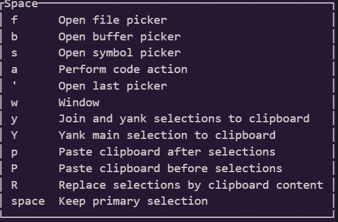

こんにちは。静カニです。約1週間ほど前、私はhelixからneovimに乗り換えて、vimmerになりました。今回は、この理由を書いていきます。  
あとなんとなく今入れてるプラグインも書いておきます。
※この記事は、[vim駅伝](https://vim-jp.org/ekiden/)の327本目の記事です。前回の記事は、[yuys13さん](https://github.com/yuys13/)の[Neovim luaのテストを書こう。neotestで高速に修正🔁テストのサイクルを回す](https://zenn.dev/vim_jp/articles/nvim-test-with-neotest-plenary)です。
## helixから離れなかった理由
先に、そもそもなぜhelixから離れなかったのかを説明しておきます。  
その理由は、一つです。ですが、されどひとつ。そのひとつが、とても大きかったのです。  
…具体的には、Spaceモードの存在です。  
helixは、挿入モード、選択モード、ノーマルモードなどがある点でvimと似ているのですが、モード系の違いでこれはとても大きいのです。

上の画像を見るとわかりますが、ファイル、バッファー、シンボルの各ピッカーがここからアクセスできるほか、クリップボード経由のコピー・ペーストもできるのです。
## neovimに乗り換えた理由
続いて、本題のneovimに乗り換えた理由ですが、まぁ、皆さん予想通り(だと思われる)、自由度の高さです。
(「vim-jpにいるんだったらvim使っといたほうが何かと有利かな」という謎な思考も相まった模様)  
ですが、この自由度の高さは前々から(helixにプラグインがないのも重なって)感じていました。ですから、何かしら最後の一押しになったものがあるはずです。
それは…  
[前のvim駅伝の記事(📘CodeCompanionを使ってNeovimと一緒に楽しくAI Coding - Minerva)](https://minerva.mamansoft.net/%F0%9F%93%98Articles/%F0%9F%93%98CodeCompanion%E3%82%92%E4%BD%BF%E3%81%A3%E3%81%A6Neovim%E3%81%A8%E4%B8%80%E7%B7%92%E3%81%AB%E6%A5%BD%E3%81%97%E3%81%8FAI+Coding)のChatGPTの「まるで"刀"を研ぐかのように、自分の環境を作り上げてきたんじゃねぇのか…！？」という発言です!  
…なんでAIに心を動かされているんだろう…自分…  
ですが、これが私がhelixからneovimに移った理由です。ちなみにvimじゃなくてneovimにしたのは特に意味はありません。
## 今入れているプラグイン
話はちょっと逸れて、執筆時点(2025/03/26日現在)入れているプラグインを紹介します。ちなみに依存関係で入っているものは紹介してません。  

- lazy.nvim…プラグイン管理
- folke/tokyonight.nvim…最近よく使っているtokyonightのテーマ
- nvim-neo-tree/neo-tree.nvim…ファイルツリー。nerdtreeじゃなくてこっちにした理由は覚えてない。helixのSpace+f相当
- j-morano/buffer_manager.nvim…その名の通りバッファーマネージャ。helixのSpace+b相当 
- hrsh7th/nvim-cmp…LSP使用時の補完用。neovim/nvim-lspconfig・mason.nvimあたりも入ってますが省略。
- nvim-lualine/lualine.nvim…知ってる人も多い、下のステータスバーを改造できる。自分でもsectionいじった。
- norcalli/nvim-colorizer.nvim…CSSとかでカラーコードとかを入れると表示してくれる。まだ使ったことない。 
- numToStr/Comment.nvim…コメントをしたり外したりしてくれる。画像に写ってないけどhelixのSpace+c相当。
- windwp/nvim-autopairs…括弧とかクオートとかを片方入力するともう片方も入力してくれる。inoremapとかよりも高性能。
- petertriho/nvim-scrollbar…右側にちっちゃいスクロールバーを追加してくれる。行数が多いファイルとかだと地味にありがたい。
- lewis6991/gitsigns.nvim…行ごとのgitのステータスを表示したりしてくれる。さっきのnvim-scrollbarと連携ができるから導入した。このおかげで数日でairblade/vim-gitgutterがクビになった。
- j-hui/fidget.nvim…右下にLSPの起動状況とかを表示してくれる。地味にありがたい。
- stevearc/aerial.nvim…コード中のオブジェクトを表示してくれる。シンボルピッカーとは違うけど、helixのSpace+sとして使ってる。
- MeanderingProgrammer/render-markdown.nvim…markdownを開いているときにうまく装飾してくれる。挿入モードの時は働かないから書くときは邪魔にならない。ちなみに書いている途中にカーソルを合わせてもそこの部分だけ働かなくなることに気づいた。
- jghauser/mkdir.nvim…存在しないディレクトリの中のファイルを開いたときに、自動的にディレクトリを保存してくれる。意外と使うシチュエーションが多い
## 最後に
そのうちdpp.vimとか導入したい!(難しすぎる)  
neovimの自由度が高すぎる!

