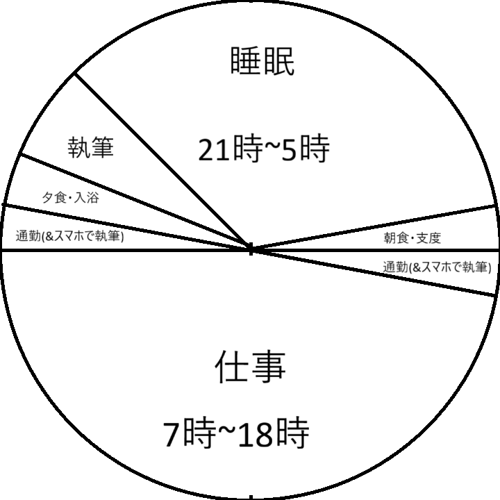

こんにちは。11月も半ばで夏ズボンを履いてしまって寒い静カニです。前回次の本が迫っていると書きましたが、その迫っている本です。
マンガだったので爆速で読み終わりました。

※この記事は、あくまで私が思ったことを書き散らしただけなので、著者等の見解とは一切関係ありません
## あらすじ
著者さんは、芸術や物書きになりたいようです。ですが、実現できそうにありません。
とここで、ジムという謎の人物が出てきました。多分リアルに来たんじゃなくて脳内に入ってきたんでしょう。
ということで、ジムが事務を著者さんに教えていきます。冗談みたいですがそんな感じです。

今回は小説とかじゃないタイプの本なので、あらすじはこのぐらいです。
## 感想
私も物書きだけで食っていくというのは厳しいとは思いますが、副業的に物書きをできたら面白そうだな、と思いました。
ということで、これの指示通りにやってみたいと思います(といいつつ10年後ではなく20年後ぐらい)。

※小さい時間が書いてないものは全部1時間ずつのつもりです

勢いで作ってましたが、面白そうですね。年収は...とりあえず700万円ぐらいあったらいいのかな(※金銭感覚が分からない人)。
作中では次の日からそれ通りの生活を送っていましたが、私は学生の身ですから、こんなことは到底無理です。
まぁ、執筆はJust nowで電車の中で(PCでとはいえ)していますから、就職した瞬間に(仕事の時間さえ思い通りになれば)、実現できるようになると思います。

読書感想文で小説もの以外を書いたのは[初回]()ぶりでしょうか。最後まで読んでくださり、ありがとうございました。
