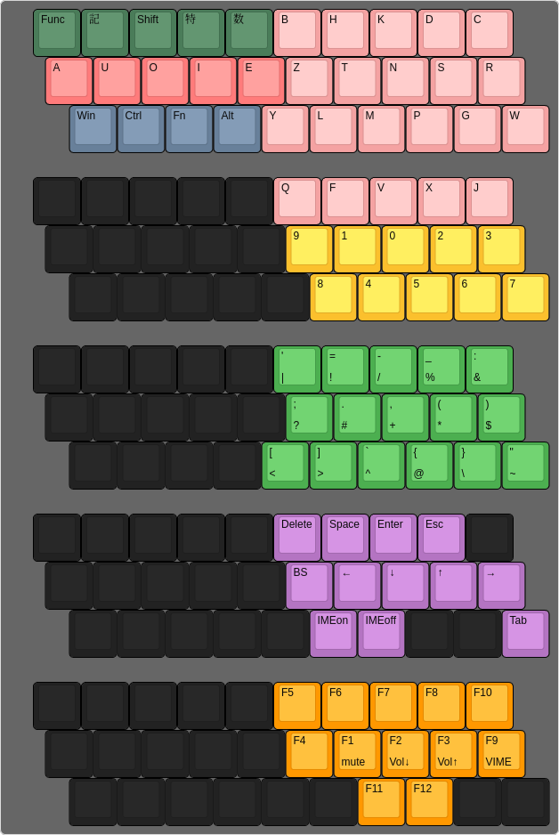

こんにちは。マウスなしでPCを操作して気持ち良くなっている静カニです。マウスなしで操作するにはキーボードを使いますよね。キーボードには配列という概念があります。
おっとこんなところに自作できそうな要素がありますね。ということで自作していきたいと思います。
## 基本条件
- キー数をなるべく減らす
- 母音&layerキーを左手、子音を右手に配置する
- 日本語英語共通にする
- layerキーを一つの指に固めずに親指・小指に優しくする
- 将来は自作キーボードに搭載したいがとりあえず通常のLaptopのキーボードでも搭載できる形にする
## 使用場面
日本語/英語でどちらを使用するか迷ったときの優先順位設定のために、私がこの配列を使うのはどのような場面になるか検討してみます。
一応一回あたり×場数の打鍵数が多そうな順番に並べます。

1. 日記を付ける
1. ブログを書く
1. AIチャット
1. dotfilesいじり
1. チャットツール

結論:日本語を書くことの方が圧倒的に多い

将来はまたやることが変わって英語を書くユースケースが増えるかもしれませんが、とりあえず今のところは日本語優先で英語を打つときに発狂しない程度にしておきましょう。
## 左手配置決め
左手は色んなレイヤー（Functionや記号など）を一気に並行して決める必要があって面倒くさそうなので、気合を入れるために先に左手から決めていきます。
右手の通常レイヤーは後から単発で決められますしね。
### 母音配置決め
内容物がはっきりしているので母音の配置を決めます。とりあえず一般的なQWERTY配列のASDFGの部分にいい感じに配置することになります。

ここで考えなければいけないのはeという微妙に扱いが面倒な音です。英語において最も使われる文字はeですが、日本語で最も使われない母音もeです。
ということでさっきの使用場面のところに照らすと、eをホームポジション外のG相当に追いやるのがよさそうです。

日本語において、eiというのは伸ばす音なのでよく使われます。
これは後でAZIKの拡張母音に相当するものを付け加える予定なので、eiの音を打つときに使いづらくする判断は比較的妥当だと言えます。
日本語の母音の使用頻度はaiuoeとかだった気がするのでiをFに置いてもギリギリセーフでしょう。英語の複数形でiesを使うことは考えないものとします。

デファクトスタンダードと同じことは正義なのでaはAの位置に置いておきます。
残ったu,oはなんかDがoっぽいのでsがu、dがoにしておきましょう。
ということで母音(左手中段)部分は、
```
A U O I E
```
という設計になりました。
### layerキー決め
右手残りのlayerキーを決めましょう。まずlayerキーの内容物を確認します。

- Ctrl,Shift,Win,Alt,Fn
- 数字
- ファンクションキー
- 特殊キー
- 記号

左手に余っているのは上段と下段です。
まあノリで上段に数字とかみたいな普通に文字入力として使うもの、下段にCtrlとかみたいなショートカットキーでしか使わないものを置くことにします。
#### ショートカットキー専用キー
文字として入力する方は複雑なのでショートカットキー専用キーの方を検討していきます。内容物はCtrl,Shift,Win,Alt,Fnですね。これに割り当てられたキーはZXCVあたりです。
内容物とスペースの数がズレているのでどれかを村八分にする必要があります。考えたらShiftキーは文字入力にも使うことがあるので上段に行ってもらいます。
これで残る候補はCtrl,Win,Alt,Fnです。この中での優先順位を決めていきます。正直Altキーは私の環境ではほとんど使わないので優先順位一番下で大丈夫でしょう。
Fnキーはごくたまに使うので下から二番目、Ctrlも超使う感じはしないので下から三番目、WinはないとSwayが操作できないので一番上でよいでしょう。

ということでZXCV各キーの、layerキーとしての打ちやすさを比べてみます。
zhxhchvh…やっぱりzはいつものShiftキーに近いので比較的慣れた打鍵体験で打ちやすく感じます。ということで左に行くほど優先順位が高いものを配置します。
ということでショートカットキー専用キー(左手下段)は
```
Win Ctrl Fn Alt
```
という設計になりました。
#### 文字入力として使うキー
今度は文字入力として使うキーです。内容物はShift、数字、ファンクションキー、特殊キー、記号です。
特殊キーの説明を一切していませんでしたが、矢印キーやBackSpace、Enterキーのような操作系のキーとも言い換えられるでしょう。
また、数字layerに関しては、通常layerで入り切らなかった子音を入れることも想定しています。

とりあえず優先順位を決めましょう。特殊キーは正直HJKLが破綻することも考えると使い倒すことが考えられるので一番上ですね。
数字キーもかなりの頻度で使っている気がします。二番目です。Shiftが三番目でしょうか。ファンクションキーはほぼ使わないので一番下、記号は四番目でよいでしょう。

打ちやすいキー比較を左手上段でもしていきます。今回はlayerキーなので同時押しで。qhwhehrhth…正直qキーは普段からあまり打たないので打ちにくい印象を持ちます。
一方でrとかはよく使うので打ち慣れていますね。RTEWQとかの順番でよいでしょう。
文字入力として使うキー(左手上段)は
```
Function 記 Shift 特 数
```
という設計になりました。
## 右手
楽に終わる左手が埋まってしまったので右手に取りかかります。右手の内容物は標準layerにおいては子音のみです。
右手のキー数は3段×5列で15ぐらいで検討してます。つまり全ての子音を標準layerに入れることはできないため6つを数字layer側に移住させる必要があります。
…と思いましたが、子音は21文字、数字は10文字あります。
合計31文字を2layerのみで捌くことは無理があるので、一般的には左手とされている微妙なところにあるBキーを右手判定にしてしまいましょう。
### 強制移住対象の検討
移住させるキーを日英それぞれで使わない文字を挙げて検討していきます。

- 日本語
  - C
  - F
  - J
  - Q
  - V
  - X
  - L
- 英語
  - Z
  - Q
  - X
  - J
  - V
  - K

共通しているQ,X,J,Vはとりあえず問答無用でシベリア…じゃなくて数字layer送りにします。日本語の方の残りはC,F,Lです。
一応その中だとFが一番使わないっぽいのでFも数字layer行きにしましょう。

ということで強制移住対象はQ,X,J,V,Fキーです。
### 打ちやすさ決め
ここからは右手のそれぞれのlayerにおいてのキー配列を決めていきます。
ですが結局また優先順位とか言い出しそうな気がするので打ちやすさを決めます。一応復習で、右手に割り当てられているキーはYUIOPHJKL;NM,./(+B)です。

比較するまでもなく最も打ちやすい軍はJKL;でしょう。そしたら取り巻きの優先順位を検討します。
YHNはJの打ちやすいものの次にHの打ちやすいものが来ると困るため、YHN(+B)は下の方に置きます。あと私には右手下段が打ちづらいためその次に下に置いておきましょう。

ということで右手の打ちやすさランキングはJKL;UIOPM,./HYNBです。
### 標準layer
やっとこさ標準layerの配列を決定できます。調べたところ今回の内容物の中の使用頻度ランキングは英語ではTNSRHLDCMPGWYBKZになっています。
一旦この使用頻度ランキングと例の打ちやすさ順を突き合わせてそのままキー配列に表すと以下のようになります。
```
B H L D C
 Y T N S R
Z K M P G W
```
ここから日本語配列として使えるように改造していきましょう。第一に検討しないといけないのは、Yの位置です。
Yは拗音に使用するため、Yをうまく配置しないと二連続で行う右手での入力が気持ち悪くなってしまいます。ここで目をつけられるのがQWERTYでのB相当のキーです。
ここは左手からも右手からも同じぐらいの距離にあります。つまりここにYキーを配置することで、適宜右の二連入力から左の二連入力に置き換えることができます。

あとはLとKが日本語における使用頻度がどう見ても逆なので入れ替えておきます。

上記二つの変更を適用するとこんな感じになります。
```
B H K D C
 Z T N S R
Y L M P G W
```
まあ日本語配列としてもそれなりに使えそうですし大丈夫でしょう。
### 数字layer
次は数字layerに入っていきます。さっきの強制移住もあるのでこのlayerの内容物はQXJVF1234567890です。
数字の使用頻度は1023456789みたいな感じらしいので、子音たちは上段に持っていって中下段でいい感じに数字を配置するとこうなります。
```
Q F V X J
 9 1 0 2 3
  8 4 5 6 7
```
### 特殊layer
次は特殊layerです。これの内容物は現時点では矢印、BackSpace、Delete、Enter、Space、Tab、Escape、IMEモード切り替えあたりでしょう。まずは矢印キーから検討していきます。
確かに私はVimmerですからHJKLに沿って設置するのもよいかもしれませんが、普通に右上に行くのに人差し指を移動させる必要があるのが許せないのでJKL;に設置します。

次にBackSpaceを検討します。Vimの挿入モードで`<C-h>`で文字を削除できるので場所的な直交性があるのでHに設置します。
Deleteは…まあBSの近くということでUあたりにしておきます。

そしたらEnterです。Vimで新しい行を挿入してInsertに移行するのがOなので直交性のようなものがあるとしてOに設置します。
Spaceは特に思いつかないのでなんか設定済みのUとOに挟まれてるIに置きます。Tabは…そこまで使わないですし`/`あたりに隔離しておきましょう。

EscapeはまあPが設定されてなくて可哀そうなのでPに置いてあげます。
IMEモード切り替えはNMあたりにONとOFFをそれぞれ設置しておきます。

ということで特殊layerはこのような配列になりました。(結構雑に略してます)
```
  Dl Sp En Es
 BS ←  ↓  ↑  →
  on of       Ta
```
### 記号layer
一番の難所記号layerです。なぜ難所かと言うと、記号ってとにかく数が多いので面倒なんですよね。
ユースケースから考えるに、使う記号は句読点の他はMarkdownが多いですがそれに限らずプログラミング言語に使われるものが多くなりそうです。

内容物の確認です。JIS配列で脳死で打って確認しておきます。`!"#$%&'()-^@[;:],./\=~|{+*}><?_`あたりでしょうか。あと`\``自体もあります。合計するとちょうど32文字です。
そしたらペアになっているものは隣り合っていると一気に打てて気持ちよくなれるので`()[]{}<>`あたりは隣接して配置させる必要があります。
よく使うものたちの確認もしておきましょう。結局私は文章を打つことが多いので句読点は一軍に入れた方がよいですね。
あとはざっと調べて出てきた`=-_:()[]{}"'#;+*$`の順番でしょうか。他にフィーリングも含めて順位をつけると`.,()=-_:{}[]"';#+*$!/%&^@\~|><?`とかでしょうか。
`:`と`{`の間に`\``も入れておきます。そんな感じで配列を作るとこんな感じになります。下がShiftも追加で押した場合です。
```
' = - _ :
 ; . , ( )
[ ] ` { } "

| ! / % &
 ? # + * $
< > ^ @ \ ~
```
`,`と`.`のような似ているものはShift押すと相方が出てくるシステムでもよいかもと思いましたが、普通にEとWの同時押しは結構面倒なので頻度優先です。
### Function layer
最後にFunctionキーのlayerです。ここはとりあえず音量調節とVIME起動ぐらいしかやることありません。Fnキーとこのlayerのキーを同時押しすると普通のF1とかになるシステムにするつもりです。
1がmute、2が音量小さく、3で大きく、9でVIME起動とかでいいでしょう。ってことで配列はこんなんで。
```
 5  6  7  8 10
  4  1  2  3  9
   11 12
```
## 配列まとめ
配列をまとめておきます。KLEで作りました。

Row dataはこんな感じです。
```
[{x:0.5,c:"#4a7c59"},"Func","記","Shift","特","数",{c:"#f4a2a2"},"B","H","K","D","C"],
[{x:0.75,c:"#ff7b7b"},"A","U","O","I","E",{c:"#f4a2a2"},"Z","T","N","S","R"],
[{x:1.25,c:"#68809a"},"Win","Ctrl","Fn","Alt",{c:"#f4a2a2"},"Y","L","M","P","G","W"],
[{y:0.5,x:0.5,c:"#222222",a:7},"","","","","",{c:"#f4a2a2",a:4},"Q","F","V","X","J"],
[{x:0.75,c:"#222222",a:7},"","","","","",{c:"#fbc02d",a:4},"9","1","0","2","3"],
[{x:1.25,c:"#222222",a:7},"","","","","",{c:"#fbc02d",a:4},"8","4","5","6","7"],
[{y:0.5,x:0.5,c:"#222222",a:7},"","","","","",{c:"#4caf50",a:4},"'\n|","=\n!","-\n/","_\n%",":\n&"],
[{x:0.75,c:"#222222",a:7},"","","","","",{c:"#4caf50",a:4},";\n?",".\n#",",\n+","(\n*",")\n$"],
[{x:1.25,c:"#222222",a:7},"","","","",{c:"#4caf50",a:4},"[\n<","]\n>","`\n^","{\n@","}\n\\","\"\n~"],
[{y:0.5,x:0.5,c:"#222222",a:7},"","","","","",{c:"#B474C2",a:4},"Delete","Space","Enter","Esc",{c:"#222222",a:7},""],
[{x:0.75},"","","","","",{c:"#B474C2",a:4},"BS","←","↓","↑","→"],
[{x:1.25,c:"#222222",a:7},"","","","","",{c:"#B474C2",a:4},"IMEon","IMEoff",{c:"#222222",a:7},"","",{c:"#B474C2",a:4},"Tab"],
[{y:0.5,x:0.5,c:"#222222",a:7},"","","","","",{c:"#ff9800",a:4},"F5","F6","F7","F8","F10"],
[{x:0.75,c:"#222222",a:7},"","","","","",{c:"#ff9800",a:4},"F4","F1\nmute","F2\nVol↓","F3\nVol↑","F9\nVIME"],
[{x:1.25,c:"#222222",a:7},"","","","","","",{c:"#ff9800",a:4},"F11","F12",{c:"#222222",a:7},"",""]
```
## 実装
そろそろ記事を締めたいのですが一番大事な段階があります。実装です。ただリアルであと2週間ぐらいしたら期末試験が終わるので一旦そこまで寝かせます。
夏休みに新しいキー配列会得したいですからね。

…と思いましたが試験終了の瞬間に練習を始められるようにという名目での実装ツール選定や実装をして現実逃避していきます。
### 実装ツール選定
ということで実装ツールを選定します。この界隈にはXmodmapとかkeydとかがいますが私は既にkeydを使っているのでそれを使えばよいでしょう。
### 実装
ここからは地獄の実装タイムです。とここで思ったのですが、この配列名前が付いてませんね。
左上がFunction、Symbol、Shift、Special、Numberなので頭文字をとってFSSSN配列とかにしておきます。読み方はふすすすぬとかにしておきます。
ということでfsssnブランチを切って実装していきます。

JIS配列とUS配列が交差していると訳分からんことになるので回りを全部US配列で固めてkeydで実装します。期末試験も終わったので一気に書いておきます。
```nix
{ ... }:
{
  services.keyd = {
    enable = true;
    keyboards = {
      default = {
        ids = [ "*" ];
        settings = {
          main = {
            # 左手上段
            q = "layer(function_layer)";
            w = "layer(symbols_layer)";
            e = "layer(shift_layer)";
            r = "layer(special_layer)";
            t = "layer(number_layer)";
            # 左手中段
            a = "a";
            s = "u";
            d = "o";
            f = "i";
            g = "e";
            # 左手下段
            z = "leftmeta";
            x = "leftcontrol";
            c = "layer(fn_layer)";
            v = "leftalt";

            # 右手上段
            y = "b";
            u = "h";
            i = "k";
            o = "d";
            p = "c";
            # 右手中段
            h = "z";
            j = "t";
            k = "n";
            l = "s";
            semicolon = "r";
            # 右手下段
            b = "y";
            n = "l";
            m = "m";
            comma = "p";
            dot = "g";
            slash = "w";
          };
          "shift_layer:S" = { };
          "function_layer" = {
            # 中段
            j = "mute";
            k = "volumedown";
            l = "volumeup";
            semicolon = "henkan";
          };
          "fn_layer+function_layer" = {
            # 上段
            y = "f5";
            u = "f6";
            i = "f7";
            o = "f8";
            p = "f10";
            # 中段
            h = "f4";
            j = "f1";
            k = "f2";
            l = "f3";
            semicolon = "f9";
            # 下段
            n = "f11";
            m = "f12";
          };
          "symbols_layer" = {
            # 上段
            y = "apostrophe"; # '
            u = "equal"; # =
            i = "minus"; # -
            o = "S-minus"; # _
            p = "S-semicolon"; # :
            # 中段
            h = "semicolon"; # ;
            j = "dot"; # .
            k = "comma"; # ,
            l = "S-9"; # (
            semicolon = "S-0"; # )
            # 下段
            b = "["; # [
            n = "]"; # ]
            m = "`"; # `
            comma = "{"; # {
            dot = "}"; # }
            slash = "S-apostrophe"; # "
          };
          "symbols_layer+shift_layer" = {
            # 上段
            y = "|"; # |
            u = "!"; # !
            i = "slash"; # /
            o = "%"; # %
            p = "S-7"; # &
            # 中段
            h = "?"; # ?
            j = "#"; # #
            k = "S-equal"; # +
            l = "S-8"; # *
            semicolon = "$"; # $
            # 下段
            b = "<"; # <
            n = ">"; # >
            m = "`"; # `
            comma = "@"; # @
            dot = "backslash"; # \
            slash = "~"; # ~
          };
          "special_layer" = {
            # 上段
            u = "delete";
            i = "space";
            o = "enter";
            p = "escape";
            # 中段
            h = "backspace";
            j = "left";
            k = "down";
            l = "up";
            semicolon = "right";
            # 下段
            n = "C-f1"; # n,mに関してはVim側で受け取れるか検証
            m = "C-f2";
            slash = "tab";
          };
          "number_layer" = {
            # 上段(使わないアルファベット)
            y = "q";
            u = "f";
            i = "v";
            o = "x";
            p = "j";
            # 中段
            h = "9";
            j = "1";
            k = "0";
            l = "2";
            semicolon = "3";
            # 下段
            n = "8";
            m = "4";
            comma = "5";
            dot = "6";
            slash = "7";
          };
        };
      };
    };
  };
}
```
解説はしなくてもみなさんならソースコード見れば分かると思います。
## 速度
ちなみにdashboardにExampleとしてショートカットがある謎ポエムの最初の英語連日本語連を入力する時間をQWERTYで測ったところ150秒ぐらいでした。
現在のFSSSNでやったら600秒ぐらい普通にかかりそうなのでいつ150秒を越えられるか気になります。
## まとめ
静カニが挑戦\[自作配列\]を完了しました

