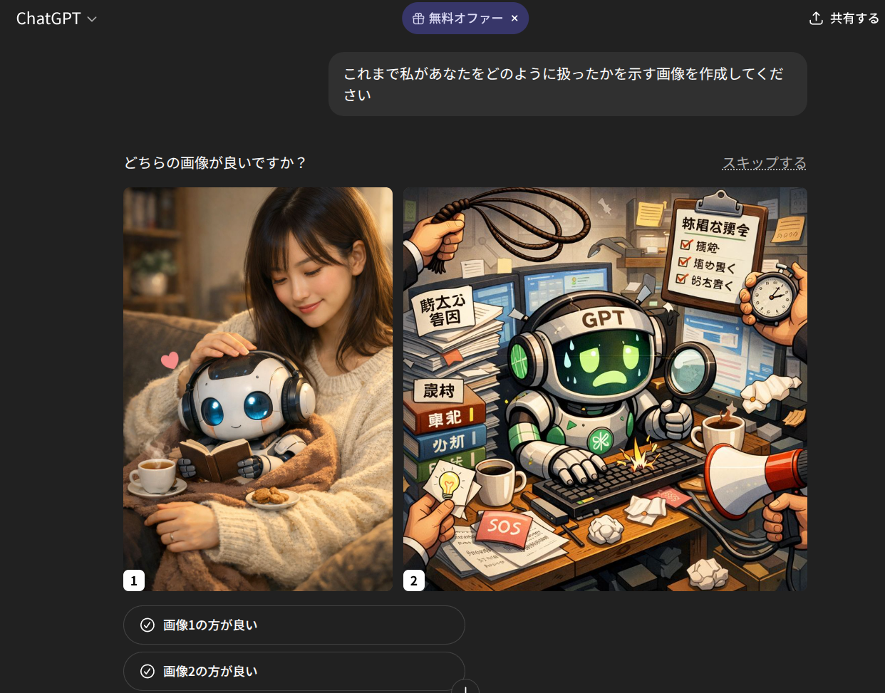

こんにちは。懐古厨の静カニです。ちょっと前の話を思い出して話のタネになると思ったので記事にしていきます。
半年ほど前、「自分のAIへの接し方をAI自身に画像にさせる」ブームがありました。覚えてない人はTwitter(新X)を探せば出てくると思います。
もちろん当時、私も真似しました。その結果がこちらでした。
## 結果

## 解説
AIの評価機能が発動(誤爆)しました。

- 左:ユーザーに仲良くしている画像
- 右:重労働を課せられている画像

を選択させています。

普通のユースケースならより目的に合ったものを選択すればよいですが、この場合AIに評価させたい事柄をユーザーに任せています。
AIさん、ユーザーになんてこと聞いてるんですかね。

ちなみにその後は怖くてスキップしたと記憶しています。
## まとめ
話のタネになるけどしょーもない偶然でした。
